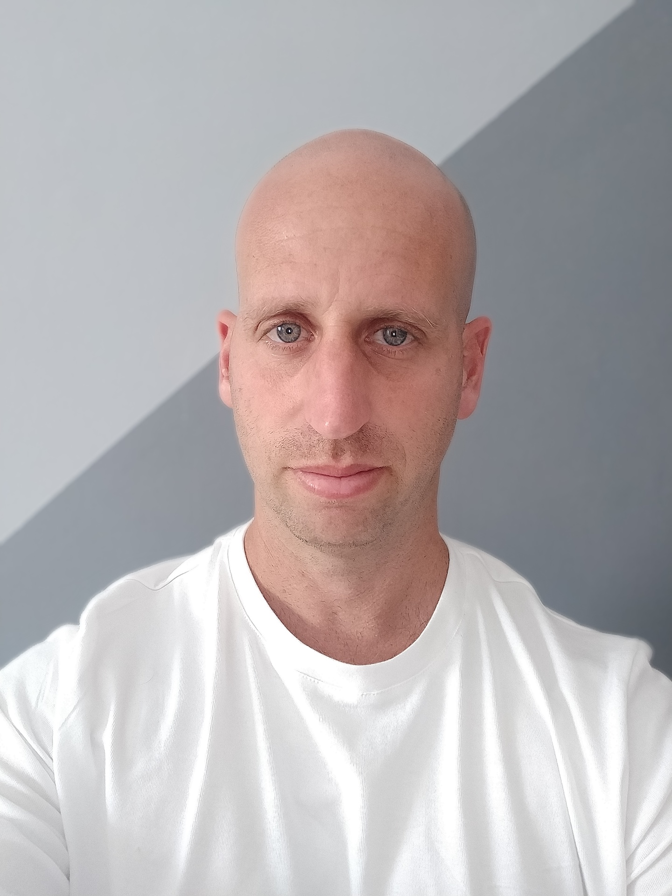

# Ronen Konfortes

</img>

```
PHONE +972546825502
EMAIL konfortes@gmail.com
```

## OBJECTIVE

Experienced Software Engineer.  
Highly skilled with backend systems and infrastructure design, implementation, testing, deployment, and monitoring.
Problems solver, team player, looking for a challenging and interesting position, developing or (preferably) building from scratch meaningful products together with great people.

## SKILLS

- Backend Systems Architecture and Design
- Programming Languages - Go, Node.js (ES6/Typescript), Python, Ruby, Scala
- Micro-Services
- Event Driven Systems: Kafka, Kafka Streams
- K8s & K8s Ecosystem
- Observability: Prometheus Jaeger, Grafana, New Relic
- Cloud: AWS, GCP
- Testing
- CI/CD: CircleCI, Jenkins, ArgoCD, Harness
- Relational Databases: PostgreSQL, MySQL
- No-SQL Databases: Elasticsearch, DynamoDB, Redis

## EXPERIENCE

### ***Senior Software Engineer***@Riskified (_August-2019 - currently_)

E-commerce fraud detection.  
Infrastructure team supplying applicative infrastructure to dev teams.  
Scala, Ruby on Rails, Node.JS, Kafka, K8S, PostgreSQL, Elasticsearch, DynamoDB, Redis, Observability, CI/CD, Stream Processing, Workflows.

### ***Senior Software Engineer***@First DAG (_September-2018 - June-2019_)

Blockchain and crypto-currencies solutions and infrastructure.  
Core dev team.  
Node.Js, Typescript, Golang, PostgreSQL, AWS.

### ***Senior Software Engineer***@Gett (_February-2015 - May-2018_)

On-demand transportation.  
Designing, implementing, deploying and monitoring Gett's high scale on-demand services, Back office systems and mobile RESTful APIs.  
Building from scratch the company's Carpool system - design through development, testing, production deploy, launch and operational support.  
Ruby on Rails, Golang, PostgresSQL, MySQL, Redis, Rabbit MQ, AWS, Firebase, Javascript, React, Vue.JS.

### ***Fullstack Developer***@Schneider Electric (_July-2012 - January-2015_)

Energy BI.  
Development of a SaaS product for managing and analyzing energy consumption.  
.NET, C#, SQL Server, ExtJS, Microsoft Azure.

### ***Software engineer***@IFN Solutions (_April-2010 - May-2012_)

ECM and BPM.  
Development and maintenance of the company's products.  
.Net, C#, Oracle DB, SQL Server, WPF, Silverlight.
</br>

## EDUCATION

### B.sc Computer Science at the Academic College of Tel Aviv Yafo. Tel-Aviv

Advanced courses in Mathematics, Programming, Architecture, Databases, Operating systems, etc.
